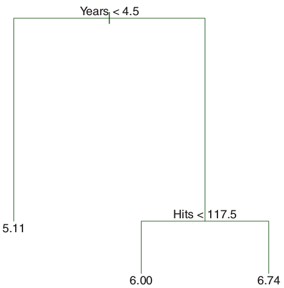
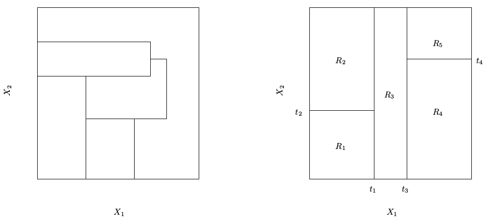
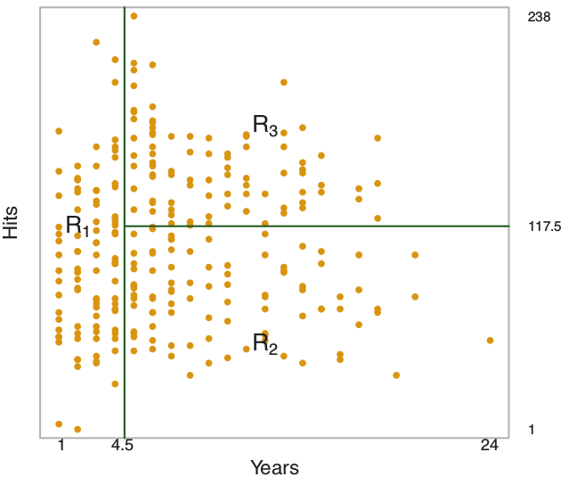
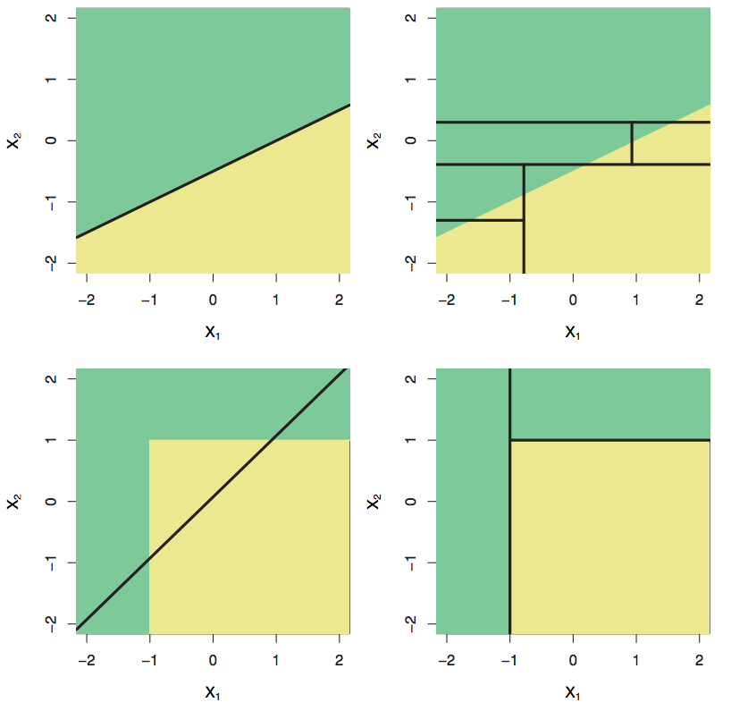

========================================================
title: false
author: John Peach
date: 2018-01-23
autosize: true
font-family: 'Helvetica'

$\LARGE Categorical \text{ } and \\
\LARGE Regression \text{ } Trees \text{ } (CART)$

**$$\LARGE OCRUG$$**

Tree Terminology
========================================================

* Internal nodes
* Leaves / terminal nodes
* Branch

***

$\tiny \mathbb{R}_1 = \{X|Years<4.5\} \\
\tiny \mathbb{R}_2 = \{X|Years>=4.5, Hits<117.5\} \\
\tiny \mathbb{R}_3 = \{X|Years>=4.5, Hits>=117.5\}$

Risk Terminology
========================================================

**Prediction risk**:

The expected error when the real answer is $\underline{y}$ and you predicted $F(\underline{x})$ given data $\underline{x}$

**Misclassification risk**:

The prediction risk associated with classifications.

* We do not know the prediction risk because we do not know the joint probability of $y$ and $\underline{x}$
a.k.a. ($\mathbb{E}_{y\underline{x}}$)

Learning Procedures
========================================================

1. **Structural Model**
$$\hat{F}(\bar{x}) = \hat{F}(\bar{x}; \bar{a}) \in \mathbb{F}(\bar{a})$$
    * $\mathbb{F}$ is a class of functions indexed by parameters $\underline{a}$
    * $\hat{F}$ is a specific function with parameters $\underline{a}$ and obs $\underline{x}$
1. **Score Criterion**
$$\mathbf{s}(\underline{a}) = \mathbb{E}_{y\underline{x}} L(y, \hat{F}(\underline{x}; \underline{a}))$$
    * $L$ is a loss/cost function
    * $y$ is the observed outcome
1. **Search Strategy**
$$\hat{\underline{a}} = \underset{\underline{a}}{argmin} \text{  } \mathbf{s}\left(\underline{y}, \hat{F}(\underline{x},\underline{a})\right)$$

Structural Model - Regression
========================================================

$$F(\underline{x}) = \sum_{m=1}^{M} c_m \mathbf{I}(\underline{x} \in \mathbb{R}_m)$$
* $\left\{ \mathbb{R}_m \right\}_1^M$ are the sub-regions of the input variable space
* $\mathbb{S}$ = set of all possible joint values of $\underline{x}$
    * $\underline{x} \in \mathbb{S}$
* $\mathbb{R}_m \subseteq \mathbb{S}$
* **Indicator function** $\mathbf{I}(l) = \left \{ \begin{array}{cl} 1 & True \\ 0 & False \end{array} \right.$
* $c_m$ is some number for region m

Score Criterion - Regression
========================================================

**Least Squares**

$$\left \{ \hat{c}_m, \hat{\mathbb{R}}_m \right \}_1^M = \underset{\left \{ \hat{c}_m, \hat{\mathbb{R}}_m \right \}_1^M}{argmin} \sum_{i=1}^N \left [ y_i - \sum_{m=1}^M c_m \mathbf{I}(\underline{x}_i \in \mathbb{R}_m) \right ]^2$$

Loss function
========================================================

* We prefer an exact $\mathbf{L}$ but generally use a surrogate like least squares
    * hope surrogate $\mathbf{L}$ is similar enough to the true $\mathbf{L}$ that it is useful
    * As $F(\underline{x}) \rightarrow y$ then $\mathbf{L}$ will get smaller.

Search Criterion
========================================================

* Determining $\left \{ \hat{c}_m \right \}_1^M$ and $\left \{\hat{\mathbb{R}}_m \right \}_1^M$ is computationally unfeasible
* As we have defined it so far
    * $\left \{\hat{\mathbb{R}}_m \right \}_1^M$ are M regions that can take on any shape and overlap
    * $\left \{ \hat{c}_m \right \}_1^M$ are M models that predicted value in $\mathbb{R}_m$

Search Criterion - Restrictions
========================================================

* Regions are disjointed
$$\hat{\mathbb{R}}_i \cap \hat{\mathbb{R}}_{j} = 0 \text{  where  } i \ne j$$
* Regions cover the input space
$$\mathbb{S} \subseteq \cup_{m=1}^M \mathbb{R}_m$$
* Predict the null model
    * Given $\left \{\hat{\mathbb{R}}_m \right \}_1^M$
    * Let $c_m = \bar{y}_m \text{ where } \bar{y}_m = \mathbb{E}\left ( y_i | \underline{x}_i \in \mathbb{R}_m \right )$

Search Criterion - Restrictions
========================================================

* Problem is still too complex
    * Impose a restriction on the shape of the region
* Split $\mathbb{S}$ such the regions are "simple"
    * Split region by Dedekind cuts, i.e.  $x_1 < 10$

Simple Example
========================================================

* Predict baseball $log(salary)$ with hits and years playing

***

1. $\mathbb{R}_1 \text{ split } Years < 4.5$
1. $\mathbb{R}_2 \text{ split } Hits < 117.5$

Trees vs. Linear Models
========================================================

Finding the Regions
========================================================

* Start with $\mathbb{R}_1 = \mathbb{S}$
* Perform a **recursive binary split**
    * Check M dimensions, within the hyper-cube, to find best dimension, $m^{*}$, to split on.
* greedy split - maximum reduction in $\mathbf{L}$
    * Split may not be ideal for the global problem
    * Split is ideal for the current sub-tree

Stopping Recursive Binary Split
========================================================

* Have a stopping criteria such as terminal node has fewer than 10 observations
* Split, even if the prediction does not change keep going
    * May allow the prediction to change in sub-regions
* What about only splitting on high threshold RSS?
* **Deep tree** is a fully grown tree

Pruning
========================================================

* Deep trees have high variance
* Select the sub-tree that gives the best test prediction error
    * Checking all possible sub-trees is computational unfeasible
* Cost Complexity Pruning
$$\sum_{m=1}^{|T|} \sum_{x_i \in \mathbb{R}_m} (y_i - \hat{F}(x_i))^2 + \alpha|T|$$
* $\alpha$ regularizes the tree to be pruned in a predictable fashion

Building a Tree
========================================================

1. Grow tall a tree using recursive binary splitting
    * stop when a node has fewer than $\Gamma$ observations
1. K-fold cross-validation
    * Cost complexity tuning at various $\alpha$ values
1. Choose $\alpha$ and its sub-tree that has the lowest prediction risk

Classification Trees
========================================================

* Similar to regression trees but used for qualitative responses
* Structural Model: most common class in a region
* Score: RSS is not going to work
* Search: Basically the same but pruning will be different

Structural Model - Classification
========================================================

Categorical Tree

* Generally, the $P_A(\underline{x})$, $P_B(\underline{x})$... are used to determine the category A, B...
* Trees follow the same approach but we need to make some adjustments
* Let $\hat{p}_{mk}$ be the portion of obs in $\mathbb{R}_m$ of class $k$
$$F(\underline{x}) = \sum_{m=1}^{M} c_m \mathbf{I}(\underline{x} \in \mathbb{R}_m)$$
$$c_m = \underset{k}{argmax} \text{  } \hat{p}_{mk}$$

Score Criterion - Classification
========================================================

1. Classification Error Rate
$$\mathbf{E}=1-\underset{k}{max}(\hat{p}_{mk})$$
1. Gini Index
$$\mathbf{G}= \sum_{k=1}^K \hat{p}_{mk}(1-\hat{p}_{mk})$$
1. Cross-entropy
$$\mathbf{D}= -\sum_{k=1}^K \hat{p}_{mk} \mathbf{log}\hat{p}_{mk}$$

Score Criterion - Classification Trees
========================================================

* Use Gini index or cross-entropy for recursive binary splitting
* Use Gini index, cross-entropy or classification error rate for pruning
    * Normally I use Gini index to grow, classification error rate to prune

Advantages of Trees
========================================================

1. Easy to explain relationships to non-technical people
1. Kind of mirrors human thought
1. Graphical display
1. Easy to interpret by non-expert
1. Can be used in human decision making
1. Can handle a mix of qualitative and quantitative predictors
1. Can be built in parallel (sort-of)
1. Insensitive to unimportant features
1. Tuning is generally easy
1. Preconditioning of data is minimal

Advantages of Trees
========================================================

1. Modifications of the algo can handle missing data
    * surrogate splitting
1. Structure model is non-parametric
    * high flexibility (capacity)
1. Insensitive to outliers
1. Aids in feature selection
    * Variable Importance Measure (VIM)
    * Boerta method

Disadvantages of Trees
========================================================

1. Generally do no produce great results on complex data
    * bagging and boosting help
1. Has high variance
    * random forest helps
1. Outcome variable may need to be standardized
1. Sensitive to correlation between features
    * Strong predictors dominate

Questions?
========================================================
title: false

$$\Huge Thank \text{ } You$$
$$ $$
$$ $$
$$\Huge Questions?$$
