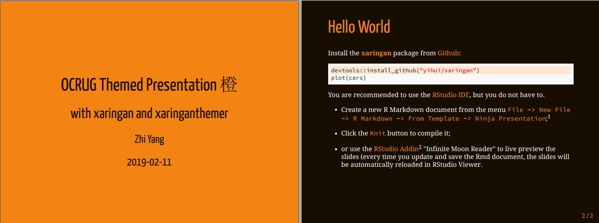
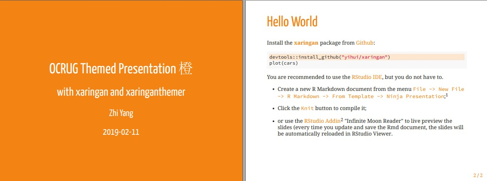
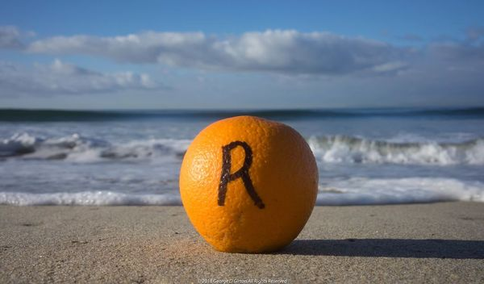
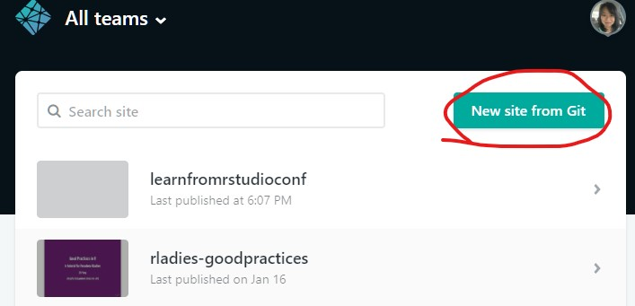
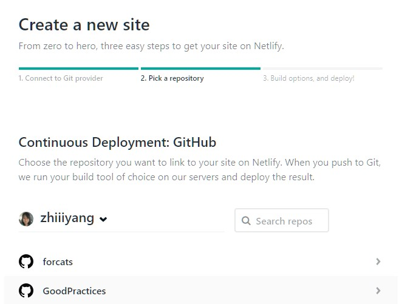
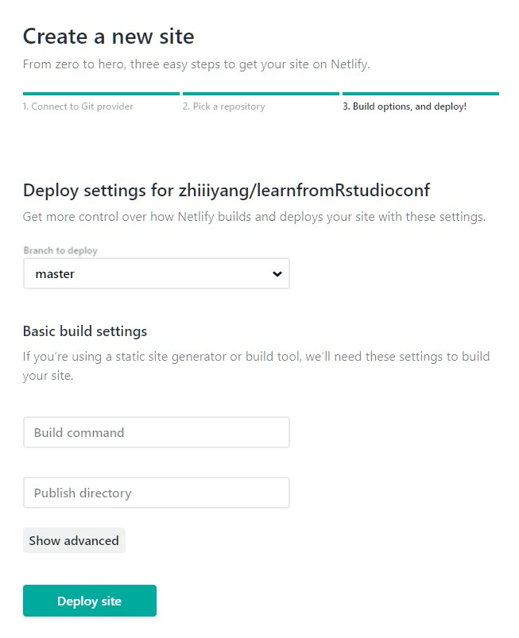
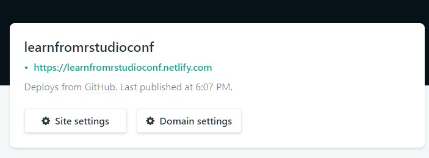
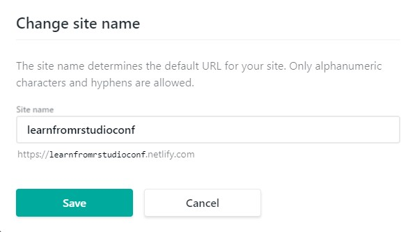

```{r setup, include=FALSE}
options(htmltools.dir.version = FALSE)
knitr::opts_chunk$set(tidy = FALSE, tidy.opts=list(width.cutoff=40))
library(babynames)
library(tidyverse)
```

# How I met xaringan 
.center[An `R` user who would like to share awesome things in `R`]
--
.pull-left[
by showing a bunch of `R code snippets` without losing taste. 

]
--
.pull-right[ 
given no time nor money on formatting codes and adjusting layouts. 

]
 
???
https://medium.com/@jakeout/deprecate-keynote-78f0f09424dd

---
# Meet xaringan 
Beautiful and concise layout

.center[ ]
.center[]
---
# Meet xaringan 
Code highlighting and live demos

.center[]


---
# Meet xaringan 
Version control and easy distribution  

.center[


]

---
# Meet xaringan 
It animates 
  
.center[
]


---
# Infinite moon reader `r emo::ji("astronaut")`
Do you use `ctrl + K` to render your slides?
  - So, Are you tired from scrolling down to the page you were working on? 

.center[]  

--

####Turn on the `Moon Reader` from either the pacakge or the addins

####From now on, the slides will auto-reload every time you `save` it

---
# Infinite moon reader `r emo::ji("astronaut")`

.center[]


---
class: center, middle

# Keyboard shortcuts
Press `h` or `?` 

--

`m` -> mirror

`b` -> blackout

`f` -> fullscreen mode

--

`c` -> clone slideshow

`p` -> presenter mode

`t` -> restart timer

---
# Themes 

- Built-in themes   

```{r eval=TRUE}
names(xaringan:::list_css())
```

--
  These go to your YAML

```{r eval = FALSE}
output:
  xaringan::moon_reader:
    css: [default, rladies, rladies-fonts] #<<
```

---
class: center, middle   
# Build your own theme




https://pkg.garrickadenbuie.com/xaringanthemer/

---
# Somewhere in the middle?

Add `my-style.css` to the YAML with the current css file 
    
```{r eval = FALSE}
output:
  xaringan::moon_reader:
    css: [default, rladies, lucy-fonts, my-style.css] #<<
```

--

While sitting in my-style.css file, 
```css
.red { color: red; }
.remark-code-line-highlighted { background-color: #e8c9e9; }
.remark-code, .remark-inline-code { 
    color: #7c347f;
    font-weight: 300;
}
```
--
I've changed it to .red[red].

---
# Where to find the themes files? 
You can find CSS files here. However, don't save your own CSS file here. 

.center[]

--

### - start with an existing theme 
### - try change something and see what happens 

---
# Meet slidex 
It converts PowerPoint slides to xaringan slides  

.center[]


---
#Start with the YAML

.pull-left[
### Simple version

```
---
title: "How to Make Slides in R"
output:
  xaringan::moon_reader
---

```
]

--

.pull-right[
### More options

```
---
title: "How to Make Slides in R"
subtitle: "Using xaringan"
author: "Zhi Yang"
date: "2019/2/26"
output:
  xaringan::moon_reader:
    css: ["default", "rladies", 
          "lucy-fonts", 
          "my-style.css"]
    lib_dir: libs
    nature:
      highlightStyle: github
      highlightLines: true
      countIncrementalSlides: false
    #chakra: "remark.js" 
---

```
]

---
# Make new slides 

Three dashes `---` gives a new slide

```
---
title: "How to Make Slides in R"
output:
  xaringan::moon_reader
---
A slide
---
Another slide


```

---
# Align an entire slide

.left-column[
###Horizontal
```
left,
*center, 
right
```
###Vertical
```
top,
*middle, 
bottom
```
]

.right-column[
```r
---
*class: center, middle 

# Demo slide

This is a center- and middle- aligned slide.
```
]

---
# Align the text 

.left-column[
###Horizontal
```
.left[texts]
*.center[texts] 
.right[texts]
```
]

.right-column[
```r
---
class: center, middle  

# Demo slide

*.right[This is a center- and middle- aligned slide.]
```
]

---

class: center, middle 

# Demo slide

.right[This is a center- and middle- aligned slide.]

---
# Incremental reveals

.left-column[

```markdown
# Hi

Did you know

--
you can

--
do this?

```
]


#Hi

--

Did you know

--

you can

--

do this?

---
# Code and higtlight
use the trailing comment `#<<` to highlight specific lines of the code

.pull-left[
Source:

````markdown
`r ''````{r}
namedata <- babynames %>%
  filter(name == "Orange") %>% 
  filter(sex == "M") %>% #<< 
  arrange(year)

head(namedata) 
```
````
]

.pull-right[
Output:

```{r eval=FALSE}
namedata <- babynames %>%
  filter(name == "Orange") %>% 
  filter(sex == "M") %>% #<< 
  arrange(year)

head(namedata) 
```
]

---
# Output and higtlight
use the chunk option `highlight.output` to highlight specific lines of the text output

.pull-left[
Source:
````markdown
`r ''````{r head, highlight.output=c(1, 3)}
namedata <- babynames %>%
  filter(name == "Orange") %>% 
  filter(sex == "M") %>% #<< 
  arrange(year)

head(namedata) 
```
````
]

.pull-right[
Output: 
```{r, highlight.output=c(1, 3), echo=FALSE}
namedata <- babynames %>%
  filter(name == "Orange") %>% 
  filter(sex == "M") %>% #<< 
  arrange(year)

head(namedata) 
```
]

---
# Two-columns
.top-column[
````md
.pull-left[
`r ''````{r refname echo=TRUE, eval=FALSE}
your R code 
```
]
.pull-right[
`r ''````{r ref.label="refname" echo=FALSE, eval=TRUE}

```
]
````
]

`.pull-left` and `.pull-right` provide 47% width 

--


.pull-left[
```{r babynames, eacho=TRUE, eval=FALSE}
namedata <- babynames %>%
  filter(name == "Orange") %>% 
  filter(sex == "M") %>% #<< 
  arrange(year)

head(namedata) 
```
]

--

.pull-right[
```{r, ref.label="babynames", echo=FALSE, eval=TRUE}

```
]

---
# Two-columns
````md
.left-column[
`r ''````{r evel = FALSE}
Your R code
```
]
.right-column[
`r ''````{r evel = FALSE, echo = FALSE}
Your R code
```
]
````

`.left-column` and `.right-column` provide 20% and 75% width 

--

.left-column[

```r
head(gss_cat)
```
]
--
.right-column[
```{r echo=FALSE, eval=TRUE}
head(gss_cat)
```
]

---
#Add a table 
```{r eval=TRUE}
head(iris, n = 3)
knitr::kable(head(iris, n = 3), format = "html")
```

Set the table to be the `HTML` format


---
#Add a plot
````{r eval=TRUE, fig.height = 5, fig.width = 5}
par(mar = c(4, 4, 1, 0.1))
plot(cars, pch = 19, col = "darkgray", las = 1)
```

use `fig.height` and `fig.width` to control the size

---
#Add an image
```r

```


---
#Resize it
Should it be something like `{width=10px}` ? `r emo::ji("cry")`

--

Option 1:
```markdown

```


--

Option 2: 
````markdown
`r ''````{r out.width = "20%", eval=TRUE}

```
````

```{r out.width = "20%", echo=FALSE, eval=TRUE}

```

---
background-image: url(/imgs/ocrug.jpeg)
background-size: cover

# Full screen  

```r
background-image: url(/imgs/ocrug.jpeg)
background-size: cover
```

---
background-image: url(/imgs/ocrug.jpeg)
background-size: contain

# Rescale only

```r
background-image: url(/imgs/ocrug.jpeg)
background-size: contain
```

---
background-image: url(/imgs/ocrug.jpeg)
background-size: contain
background-position: bottom

# Change position

```r
background-image: url(/imgs/ocrug.jpeg)
background-size: contain
background-position: bottom
```

---
background-image: url(https://secure.meetupstatic.com/photos/event/2/b/9/e/600_471491166.jpeg)
background-size: contain
background-position: bottom

# Use online image

```markdown
background-image: url(https://secure.meetupstatic.com/photos/event/2/b/9/e/600_471491166.jpeg)
background-size: contain
background-position: bottom
```

---
background-image: url(imgs/ocrug_logo.png), url(imgs/ocrug_logo.png)
background-position: 0% 100%, 100% 0%
background-size: 30%, 10%

# Logos 


```markdown
background-image: url(imgs/ocrug_logo.png), url(imgs/ocrug_logo.png)
background-position: 0% 100%, 100% 0%
background-size: 30%, 10%
```

---
# Hosting slides `r fontawesome::fa("github")`
.center[]

---
# Netlify `r emo::ji("computer")`
.pull-left[
`Step 1:` go to netlify.com


]

.pull-right[
`Step 2:` connect with your Github account



]


---
# Netlify `r emo::ji("computer")`
.pull-left[

`Step 3:` select a repo


]
--
.pull-right[

`Step 4:` select a branch


]

---
# Netlify `r emo::ji("computer")`
.pull-top[
`Step 5:` deploy a site



]

.pull-bottom[
`Step 6:` change site name



]

---
class: middle 

# More info...

.pull-left[]
.pull-right[]


---
class: center, middle

# Thanks!

<br>
@zhiiiyang

https://github.com/zhiiiyang/XaringanTutorial
<br>

Slides created via the R package [**xaringan**](https://github.com/yihui/xaringan)

Template created by [Alison Hill](https://alison.rbind.io/)


