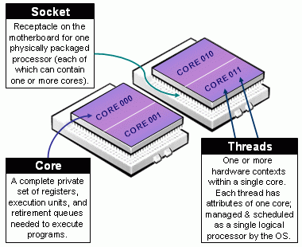

# High-Performance Computing: An overview {style="width: 80%;margin: auto;height: 80%;"}

Loosely, from R's perspective, we can think of HPC in terms of two, maybe three things:

1.  Big data: How to work with data that doesn't fit your computer

2.  Parallel computing: How to take advantage of multiple core systems

3.  Compiled code: Write your own low-level code (if R doesn't has it yet...)

(Checkout [CRAN Task View on HPC](https://cran.r-project.org/web/views/HighPerformanceComputing.html))


# Some vocabulary for HPC {style="width: 80%;margin: auto;height: 80%;"}

In raw terms

*   Supercomputer: A **single** big machine with thousands of cores/gpus.

*   High Performance Computing (HPC): **Multiple** machines within
    a **single** network.
    
*   High Throughput Computing (HTC): **Multiple** machines across **multiple**
    networks.
    
You may not have access to a supercomputer, but certainly HPC/HTC clusters are
more accesible these days, e.g. AWS provides a service to create HPC clusters
at a low cost (allegedly, since nobody understands how pricing works)

# What's "a core"? {style="width: 80%;margin: auto;height: 80%;text-align:center"}

{width="400px"}

Now, how many cores does your computer has, the parallel package can tell you that:

```{r 03-how-many-cores}
parallel::detectCores()
```

# What is parallel computing, anyway? {style="width: 80%;margin: auto;height: 80%;"}

```r
f <- function(n) n*2
f(1:4)
```

{width="50%"}

# What is parallel computing, anyway? (cont'd) {style="width: 80%;margin: auto;height: 80%;"}

```r
f <- function(n) n*2
f(1:4)
```

{width="50%"}


# {style="background-color:#515A5A;margin:auto;text-align:center;"}

<text style="color:white;">Let's think before we start...</text>

{style="width:500px"}

<text style="color:white;">When is it a good idea to go HPC?</text>

# When is it a good idea? {style="width: 80%;margin: auto;height: 80%;"}

```{r good-idea, echo=FALSE, fig.cap="Ask yourself these questions before jumping into HPC!", fig.align='center', out.width="60%"}
knitr::include_graphics("fig/when_to_parallel.svg")
```

# Parallel computing in R {style="width: 80%;margin: auto;height: 80%;"}

While there are several alternatives (just take a look at the
[High-Performance Computing Task View](https://cran.r-project.org/web/views/HighPerformanceComputing.html)),
we'll focus on the following R-packages for **explicit parallelism**

Some examples:

> *   [**parallel**](https://cran.r-project.org/package=parallel): R package that provides '[s]upport for parallel computation,
    including random-number generation'.

> *   [**foreach**](https://cran.r-project.org/package=foreach): R package for 'general iteration over elements' in parallel fashion.

> *   [**future**](https://cran.r-project.org/package=future): '[A] lightweight and
    unified Future API for sequential and parallel processing of R
    expression via futures.' (won't cover here)
    
Implicit parallelism, on the other hand, are out-of-the-box tools that allow the
programmer not to worry about parallelization, e.g. such as
[**gpuR**](https://cran.r-project.org/package=gpuR) for Matrix manipulation using
GPU, [**tensorflow**](https://cran.r-project.org/package=tensorflow)

# {style="width: 80%;margin: auto;height: 80%;"}

And there's also a more advanced set of options

> *   [**Rcpp**](https://cran.r-project.org/package=Rcpp) + [OpenMP](https://www.openmp.org):
    [Rcpp](https://cran.r-project.org/package=Rcpp) is an R package for integrating
    R with C++, and OpenMP is a library for high-level parallelism for C/C++ and
    Fortran.

> *   A ton of other type of resources, notably the tools for working with 
    batch schedulers such as Slurm, HTCondor, etc.
    
# The parallel package {style="width: 80%;margin: auto;height: 80%;"}

*  Based on the `snow` and `multicore` R Packages.

*  Explicit parallelism.

*  Simple yet powerful idea: Parallel computing as multiple R sessions.

*  Clusters can be made of both local and remote sessions

*  Multiple types of cluster: `PSOCK`, `Fork`, `MPI`, etc.

<div style="text-align: center;"></div>

# Parallel workflow {style="width: 80%;margin: auto;height: 80%;"}

(Usually) We do the following:

1.  Create a `PSOCK/FORK` (or other) cluster using `makePSOCKCluster`/`makeForkCluster`
    (or `makeCluster`)
    
2.  Copy/prepare each R session (if you are using a `PSOCK` cluster):

    a.  Copy objects with `clusterExport`

    b.  Pass expressions with `clusterEvalQ`

    c.  Set a seed

3.  Do your call: `parApply`, `parLapply`, etc. 

4.  Stop the cluster with `clusterStop`

# Ex 1: Hello world! {style="width: 80%;margin: auto;height: 80%;"}

```{r parallel-ex-psock, echo=TRUE, cache=TRUE}
# 1. CREATING A CLUSTER
library(parallel)
cl <- makePSOCKcluster(4)    
x  <- 20

# 2. PREPARING THE CLUSTER
clusterSetRNGStream(cl, 123) # Equivalent to `set.seed(123)`
clusterExport(cl, "x")

# 3. DO YOUR CALL
clusterEvalQ(cl, {
  paste0("Hello from process #", Sys.getpid(), ". I see x and it is equal to ", x)
})

# 4. STOP THE CLUSTER
stopCluster(cl)
```


# Ex 2: Parallel regressions {style="width: 80%;margin: auto;height: 80%;"}

**Problem**: Run multiple regressions on a very wide dataset. We need to fit the
following model:

$$
y = X_i\beta_i + \varepsilon,\quad \varepsilon\sim N(0, \sigma^2_i),\quad\forall i
$$

```{r lots-of-lm-dgp, echo=FALSE}
set.seed(131)
y <- rnorm(500)
X <- matrix(rnorm(500*999), nrow = 500, dimnames = list(1:500, sprintf("x%03d", 1:999)))
```

```{r lots-of-lm-print}
dim(X)
X[1:6, 1:5]
str(y)
```

# Ex 2: Parallel regressions (cont'd 1) {style="width: 80%;margin: auto;height: 80%;"}

**Serial solution**: Use `apply` (forloop) to solve it

```{r lots-of-lm-serial, cache = TRUE, strip.white=FALSE}


ans <- apply(
  
  X      = X,
  MARGIN = 2,
  FUN    = function(x, y) coef(lm(y ~ x)),
  y      = y
  )

ans[,1:5]
```

# Ex 2: Parallel regressions (cont'd 2) {style="width: 80%;margin: auto;height: 80%;"}

**Parallel solution**: Use `parApply`

```{r lots-of-lm-parallel, cache = TRUE}
library(parallel)
cl <- makePSOCKcluster(4L)
ans <- parApply(
  cl     = cl,
  X      = X,
  MARGIN = 2,
  FUN    = function(x, y) coef(lm(y ~ x)),
  y      = y
  )

ans[,1:5]
```

-----

Are we going any faster?

```{r lots-of-lm-benchmark, cache = TRUE, warning=FALSE}
library(bench)
mark(
  parallel = parApply(
    cl  = cl,
    X   = X, MARGIN = 2,
    FUN = function(x, y) coef(lm(y ~ x)),
    y   = y
    ),
  serial = apply(
    X   = X, MARGIN = 2,
    FUN = function(x, y) coef(lm(y ~ x)),
    y   = y
    )
)
```

```{r lots-of-lm-stopcluster, cache = TRUE, echo=FALSE}
stopCluster(cl)
```

# Rcpp: Hello world! {style="width: 80%;margin: auto;height: 80%; text-align:center"}

## The Fibonacci series


$$
Fib(n) = \left\{\begin{array}{ll}
n & \mbox{if }n \leq 1 \\ 
Fib(n-1) + Fib(n - 2) & \mbox{otherwise}
\end{array}\right.
$$

# Rcpp: Hello world! vers1 {style="width: 80%;margin: auto;height: 80%;"}

The following C++ file, called `fib.cpp`

```{Rcpp fib-cpp-program, cache=TRUE}
#include <Rcpp.h>

// [[Rcpp::export]]
int fibCpp(int n) {
  
  if (n < 2) {
    return n;
  }
  
  return fibCpp(n - 1) + fibCpp(n - 2);
  
}
```

Can be compiled within R using `Rcpp::sourceCpp("fib.cpp")`. This exports the function
Back into R

```{r fib-in-r}
c(fibCpp(1), fibCpp(2), fibCpp(3), fibCpp(4), fibCpp(5))
```

# Rcpp: Hello world! vers2 (with function overloading) {style="width: 80%;margin: auto;height: 80%;"}

Rcpp data types are mapped directly to R data types, e.g. vectors of integer in 
R can be used as `IntegerVector` in Rcpp.

```{Rcpp fib-cpp-program2, cache=TRUE}
#include <Rcpp.h>

using namespace Rcpp;

// inline kind of implementation
int fibCpp(int n) {return (n < 2)? n : fibCpp(n - 1) + fibCpp(n - 2);}

// [[Rcpp::export]]
IntegerVector fibCpp(IntegerVector n) {

  IntegerVector res(n.size());
  for (int i = 0; i < n.size(); ++i)
    res[i] = fibCpp(n[i]);
    
  return res;
  
}
```

Back in R

```{r fib-in-r2}
fibCpp(1:5)
```


# RcppArmadillo and OpenMP {style="width: 80%;margin: auto;height: 80%;"}

*   Friendlier than [**RcppParallel**](http://rcppcore.github.io/RcppParallel/)...
    at least for 'I-use-Rcpp-but-don't-actually-know-much-about-C++' users (like myself!).

*   Must run only 'Thread-safe' calls, so calling R within parallel blocks can cause
    problems (almost all the time).
    
*   Use `arma` objects, e.g. `arma::mat`, `arma::vec`, etc. Or, if you are used to them
    `std::vector` objects as these are thread safe.

*   Pseudo-Random Number Generation is not very straight forward... But C++11 has
    a [nice set of functions](http://en.cppreference.com/w/cpp/numeric/random) that can be used together with OpenMP

*   Need to think about how processors work, cache memory, etc. Otherwise you could
    get into trouble... if your code is slower when run in parallel, then you probably
    are facing [false sharing](https://software.intel.com/en-us/articles/avoiding-and-identifying-false-sharing-among-threads)
    
*   If R crashes... try running R with a debugger (see
    [Section 4.3 in Writing R extensions](https://cran.r-project.org/doc/manuals/r-release/R-exts.html#Checking-memory-access)):
    
    ```shell
    ~$ R --debugger=valgrind
    ```

# RcppArmadillo and OpenMP workflow {style="width: 80%;margin: auto;height: 80%;"}

1.  Add the following to your C++ source code to use OpenMP, and tell Rcpp that
    you need to include that in the compiler:
    
    ```cpp
    #include <omp.h>
    // [[Rcpp::plugins(openmp)]]
    ```

2.  Tell the compiler that you'll be running a block in parallel with openmp
    
    ```cpp
    #pragma omp [directives] [options]
    {
      ...your neat parallel code...
    }
    ```
    
    You'll need to specify how OMP should handle the data:
    
    *   `shared`: Default, all threads access the same copy.
    *   `private`: Each thread has its own copy (although not initialized).
    *   `firstprivate` Each thread has its own copy initialized.
    *   `lastprivate` Each thread has its own copy. The last value is the one stored in the main program.
    
    Setting `default(none)` is a good practice.
    
3.  Compile!

# Ex 3: RcppArmadillo + OpenMP {style="width: 80%;margin: auto;height: 80%;"}

Computing the distance matrix (see `?dist`)

```{Rcpp dist-code, cache=TRUE, echo=TRUE}
#include <omp.h>
#include <RcppArmadillo.h>

// [[Rcpp::depends(RcppArmadillo)]]
// [[Rcpp::plugins(openmp)]]

using namespace Rcpp;

// [[Rcpp::export]]
arma::mat dist_par(const arma::mat & X, int cores = 1) {
  
  // Some constants
  int N = (int) X.n_rows;
  int K = (int) X.n_cols;
  
  // Output
  arma::mat D(N,N);
  D.zeros(); // Filling with zeros
  
  // Setting the cores
  omp_set_num_threads(cores);
  
#pragma omp parallel for shared(D, N, K, X) default(none)
  for (int i=0; i<N; ++i)
    for (int j=0; j<i; ++j) {
      for (int k=0; k<K; k++) 
        D.at(i,j) += pow(X.at(i,k) - X.at(j,k), 2.0);
      
      // Computing square root
      D.at(i,j) = sqrt(D.at(i,j));
      D.at(j,i) = D.at(i,j);
    }
      
  
  // My nice distance matrix
  return D;
}
```

<!-- # {style="width: 80%;margin: auto;height: 80%;"} -->

<!-- ```{r dist-dat, dependson=-1, echo=TRUE, cache=TRUE} -->
<!-- # Simulating data -->
<!-- set.seed(1231) -->
<!-- K <- 1000 -->
<!-- n <- 500 -->
<!-- x <- matrix(rnorm(n*K), ncol=K) -->

<!-- # Are we getting the same? -->
<!-- table(as.matrix(dist(x)) - dist_par(x, 4)) # Only zeros -->
<!-- ``` -->

# {style="width: 80%;margin: auto;height: 80%;"}

```{r dist-dgp, echo=TRUE, cache=TRUE}
set.seed(1231)
K <- 1000
n <- 500
x <- matrix(rnorm(n*K), ncol=K)
```


```{r dist-benchmark, echo=TRUE, cache=TRUE}
# Benchmarking!
rbenchmark::benchmark(
  dist(x),                 # stats::dist
  dist_par(x, cores = 1),  # 1 core
  dist_par(x, cores = 2),  # 2 cores
  dist_par(x, cores = 4), #  4 cores
  replications = 10, order="elapsed"
)[,1:4]
```

# {style="text-align:center!important;"}

```{r thanks, out.width="300px", echo=FALSE}

```

## Thanks!

<p style="text-align:center!important;">
`r icon::fa("github")`  [gvegayon](https://github.com/gvegayon/) <br>
`r icon::fa("twitter")`  [\@gvegayon](https://twitter.com/gvegayon) <br>
`r icon::fa("home")`  [ggvy.cl](https://ggvy.cl)<br><br>
<text style="color:gray;font-size:80%">Presentation created with [rmarkdown::slidy_presentation](https:cran.r-project.org/package=rmarkdown)</text>
</p>

# See also {style="width: 80%;margin: auto;height: 80%;"}

*   [Package parallel](https://stat.ethz.ch/R-manual/R-devel/library/parallel/doc/parallel.pdf) 
*   [Using the iterators package](https://cran.r-project.org/web/packages/iterators/vignettes/iterators.pdf)
*   [Using the foreach package](https://cran.r-project.org/web/packages/foreach/vignettes/foreach.pdf)
*   [32 OpenMP traps for C++ developers](https://software.intel.com/en-us/articles/32-openmp-traps-for-c-developers)
*   [The OpenMP API specification for parallel programming](http://www.openmp.org/)
*   ['openmp' tag in Rcpp gallery](gallery.rcpp.org/tags/openmp/)
*   [OpenMP tutorials and articles](http://www.openmp.org/resources/tutorials-articles/)

For more, checkout the [CRAN Task View on HPC](https://cran.r-project.org/web/views/HighPerformanceComputing.html){target="_blank"}

# Bonus track: Simulating $\pi$ {style="width: 80%;margin: auto;height: 80%;"}


*   We know that $\pi = \frac{A}{r^2}$. We approximate it by randomly adding
    points $x$ to a square of size 2 centered at the origin.

*   So, we approximate $\pi$ as $\Pr\{\|x\| \leq 1\}\times 2^2$

```{r, echo=FALSE, dev='jpeg', dev.args=list(quality=100), fig.width=6, fig.height=6, out.width='300px', out.height='300px'}
set.seed(1231)
p    <- matrix(runif(5e3*2, -1, 1), ncol=2)
pcol <- ifelse(sqrt(rowSums(p^2)) <= 1, adjustcolor("blue", .7), adjustcolor("gray", .7))
plot(p, col=pcol, pch=18)
```

# {style="width: 80%;margin: auto;height: 80%;"}

The R code to do this

```{r simpi, echo=TRUE}
pisim <- function(i, nsim) {  # Notice we don't use the -i-
  # Random points
  ans  <- matrix(runif(nsim*2), ncol=2)
  
  # Distance to the origin
  ans  <- sqrt(rowSums(ans^2))
  
  # Estimated pi
  (sum(ans <= 1)*4)/nsim
}
```

# {style="width: 80%;margin: auto;height: 80%;"}

```{r parallel-ex2, echo=TRUE, cache=TRUE}
library(parallel)
# Setup
cl <- makePSOCKcluster(4L)
clusterSetRNGStream(cl, 123)

# Number of simulations we want each time to run
nsim <- 1e5

# We need to make -nsim- and -pisim- available to the
# cluster
clusterExport(cl, c("nsim", "pisim"))

# Benchmarking: parSapply and sapply will run this simulation
# a hundred times each, so at the end we have 1e5*100 points
# to approximate pi
rbenchmark::benchmark(
  parallel = parSapply(cl, 1:100, pisim, nsim=nsim),
  serial   = sapply(1:100, pisim, nsim=nsim), replications = 1
)[,1:4]

```


# Session info

```{r session, echo=FALSE}
sessionInfo()
```

