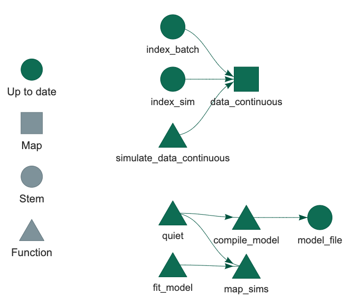
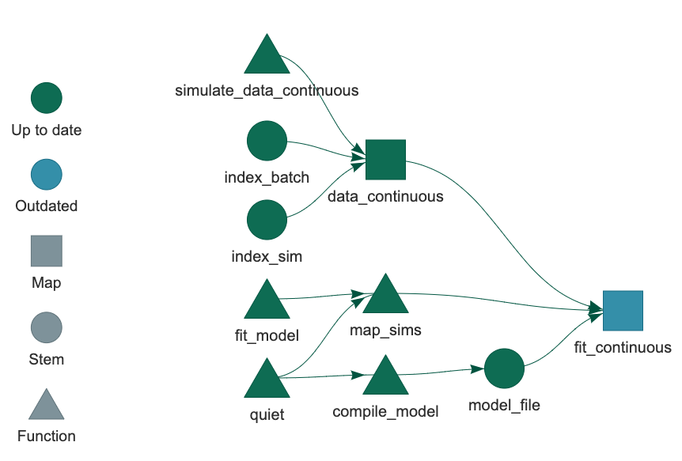
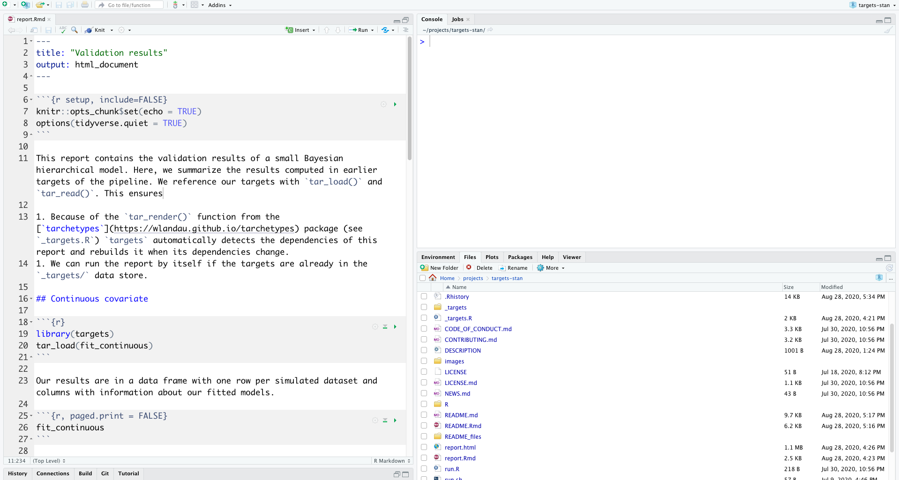
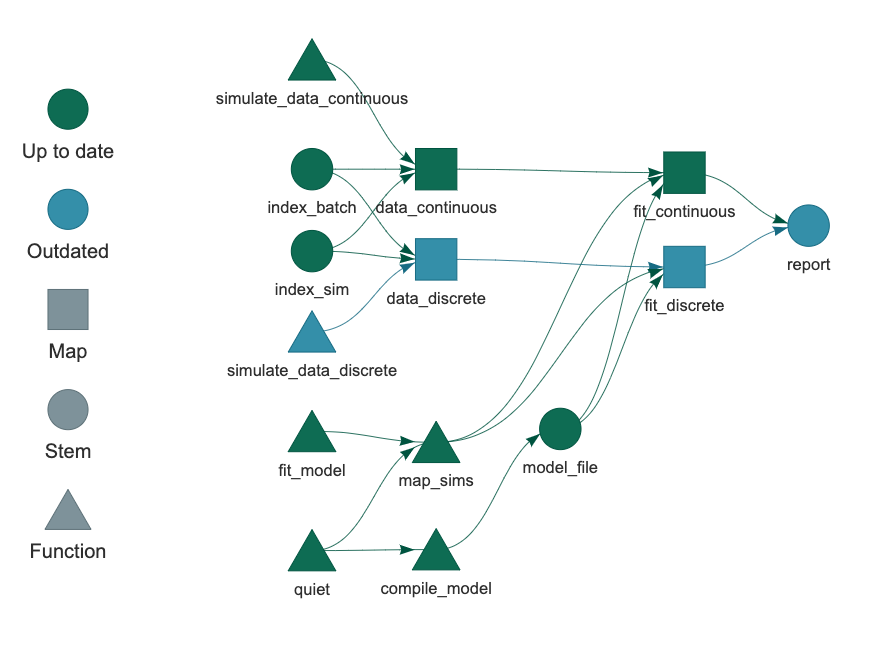
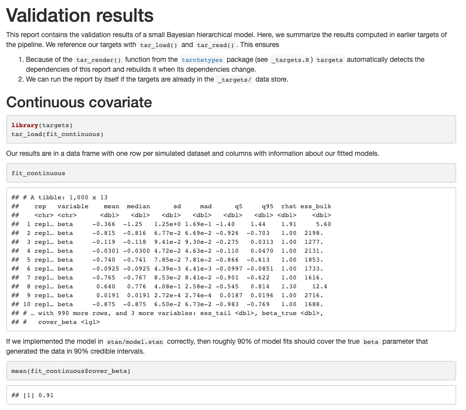
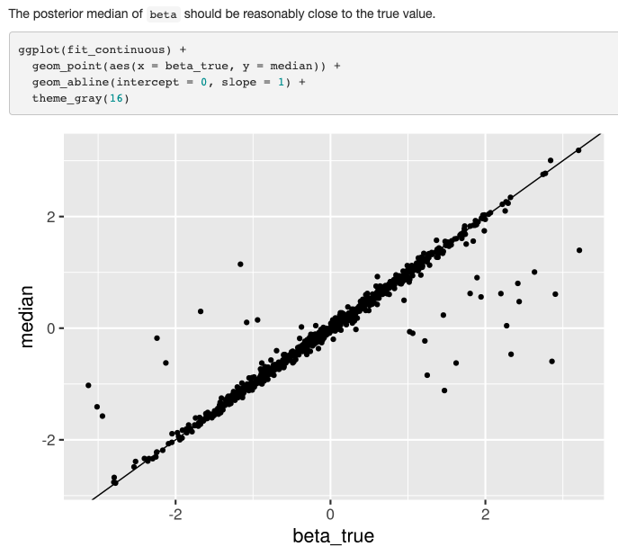
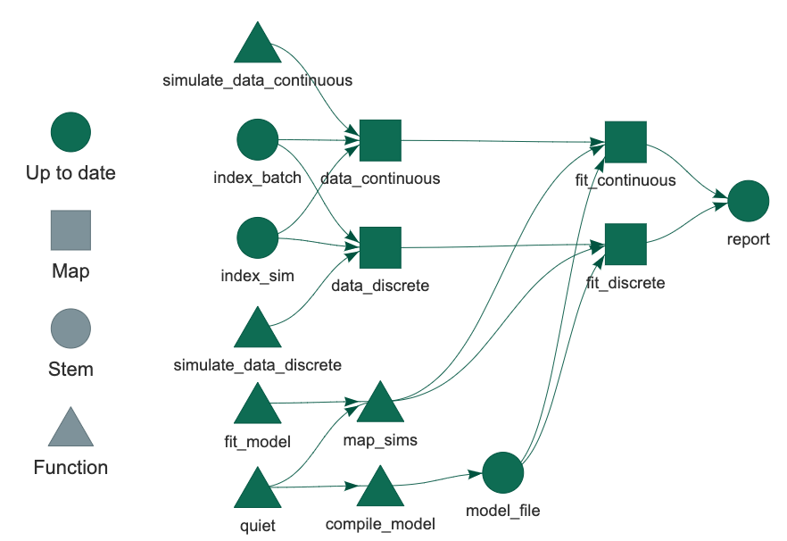

<style>
.inverse {
background-color: transparent;
text-shadow: 0 0 0px transparent;
}
.title-slide {
vertical-align: bottom !important; 
text-align: center !important;
}
.title-slide h1 {
position: absolute;
top: 0;
left: 0;
right: 0;
width: 100%;
line-height: 4em;
color: #666666;
}
.title-slide h3 {
line-height: 6em;
color: #666666;
}
.title-slide {
background-color: white;
background-image: url('images/logo.png');
background-repeat: no-repeat;
background-size: 25%;
}
.remark-slide-content:after {
content: "Copyright Eli Lilly and Company";
position: absolute;
bottom: -5px;
left: 10px;
height: 40px;
width: 100%;
font-family: Helvetica, Arial, sans-serif;
font-size: 0.7em;
color: gray;
background-repeat: no-repeat;
background-size: contain;
}
</style>

```{r, include = FALSE}
knitr::opts_chunk$set(
  collapse = TRUE,
  warning = FALSE,
  comment = "#>",
  fig.align = "center",
  fig.width = 10,
  fig.height = 7,
  out.width = "80%",
  out.height = "80%"
)
```

```{r, include = FALSE, message = FALSE}
options(
  warnPartialMatchArgs = FALSE,
  drake_clean_menu = FALSE,
  drake_make_menu = FALSE,
  htmltools.dir.version = FALSE
)
packages <- c(
  "targets",
  "keras",
  "recipes",
  "rsample",
  "tidyverse",
  "yardstick"
)
purrr::walk(
  packages,
  function(pkg) {
    suppressMessages(suppressWarnings(library(pkg, character.only = TRUE)))
  }
)
Sys.setenv(TAR_SCRIPT_ASK = "false")
tar_destroy()
```

## Large statistical computation

* [Bayesian data analysis](https://mc-stan.org/)
* [Bayesian network meta-analysis](https://bookdown.org/MathiasHarrer/Doing_Meta_Analysis_in_R/bayesian-network-meta-analysis.html)
* [Graph-based multiple comparison procedures](https://github.com/kornl/gMCP)
* [Subgroup identification](https://cran.r-project.org/web/packages/TSDT/index.html)
* [Predictive modeling](http://appliedpredictivemodeling.com/computing)
* [Deep neural networks](https://keras.rstudio.com/)
* [PK/PD modeling](https://github.com/nlmixrdevelopment/nlmixr)
* Clinical trial simulation
* Target identification

???

Thank you all for coming, and thank you to for the opportunity to speak today.

I come from the life sciences, and we develop ambitious computational workflows for Statistics and data science. There's a lot of Bayesian analysis, machine learning, etc.

---

## Common features

1. Heavy use of the [R language](https://www.r-project.org/).
2. Long runtimes.
3. Multiple sub-tasks.
4. Frequent changes to code and data.


<br>
<a href="https://openclipart.org/detail/275842/sisyphus-overcoming-silhouette">https://openclipart.org/detail/275842/sisyphus-overcoming-silhouette</a>

???

These projects require long runtimes. MCMC and deep neural nets are expensive. It could take several minutes or hours just to fit a single model. So when the code is under rapid development, we run into trouble.

---

## Interconnected tasks
<center>

</center>

???

A large workflow has a bunch of moving parts.

---

## Changes

<center>

</center>

???

If you change any one of these stages,

---

## Consequences

<center>

</center>

???

then everything that depends on it is no longer valid, and you need to rerun the computation to bring the output back up to date. Changes like this happen all the time. They usually happen much faster than it actually takes to run the project, and there's no way the results can keep up.

---

## Pipeline tools and workflow managers

<center>

</center>

- Tons exist already: [github.com/pditommaso/awesome-pipeline](https://github.com/pditommaso/awesome-pipeline).
- Most are language-agnostic or designed for Python or the shell.

???

...unless you use a Make-like pipeline tool to avoid repeating yourself. There are some great pipeline tools for workflow automation, but historically not a whole lot for R.

---

## What distinguishes `targets`?

<center>

</center>

* Fundamentally designed for R.
* Supports a clean, modular, function-oriented programming style.
* Abstracts files as R objects and automatically manages data.
* Surpasses the permanent limitations of its predecessor, [`drake`](https://github.com/ropensci/drake): <https://wlandau.github.io/targets/articles/need.html>

???

That's where targets comes in. targets is a Make-like pipeline tool that is fundamentally designed for R. You can call it from an R session, it supports a clean, idiomatic, function-oriented style of programming, and it helps you store and retrieve your results. Most importantly, it gets you out of the Sisyphean loop of long computation, enhances reproducibility, and takes the frustration out of data science.

---

## What about `drake`?

* `drake` is still an excellent choice for pipeline management, but it has permanent user-side limitations.
* `targets` was created to overcome these limitations and create a smoother user experience.
    1. Stronger guardrails by design.
    1. A friendlier, lighter, more transparent data management system.
    1. Seamless cloud integration with Amazon S3.
    1. Show which *functions* are up to date.
    1. More flexible dynamic branching, including compatibility with `dplyr::group_by()`.
    1. Improved parallel efficiency.
    1. Designed for custom user-side [metaprogramming](https://wlandau.github.io/targets-manual/branching.html#metaprogramming) and target archetypes: <https://wlandau.github.io/tarchetypes/>.
* The statement of need describes the details: <https://wlandau.github.io/targets/articles/need.html>.

???

But what about drake? drake already does this. It's never going away, I will still maintian it. However, drake has improved so much over the last four years, that the only way left to make nontrivial progress for users is to finally confront systemic limitations that drake is stuck with forever, limitations so deep in the architecture that we can't fix them without breaking the tool or existing projects that use it. So to move the general capability forward, beyond what drake will ever be capable of, we need a new package. And that package is called "targets".

---

## Guardrails in `targets`

* The only way to use `targets` is the correct way.
* Main guardrails:
    1. Always run in a fresh R process (unless you deliberately configure `targets` for debugging).
    2. Require a `_targets.R` configuration file in the project root.
    3. Require the `_targets/` data store to always be in the project root.

???

First of all, targets is deliberately less flexible. Less flexibility is actually a good thing here. Targets runs the pipeline in a clean new process by default, and it has strict policies about your working directory and data store. So it's more reproducible, more dependable, and ultimately smoother for the user.

---

## `drake`'s cache

```
.drake/
├── config/
├── data/
├───── 17bfcef645301416.rds
├───── 21935c86f12692e2.rds
├───── 37caf5df2892cfc4.rds
├───── ...
├── drake/
├── keys/
├───── memoize/
├───── meta/
├───── objects/
├───── ...
└── scratch/
```

???

Now for data management. drake's cache has a huge number of cryptically-named files. It's not portable, and it's brittle.

---

## The data store in `targets`

```
_targets/
├── meta/
├───── meta
├───── progress
├── objects/
├───── target_name_1
├───── target_name_2
├───── target_name_3
└───── ...
```

???

{targets} simplifies storage. The data store is light, portable, resilient, and easy to understand. It can recover if a data file breaks, and third-party products like Git and Dropbox and OneDrive have a much easier time.

---

## Seamless AWS S3 integration

<https://wlandau.github.io/targets-manual/cloud.html>

```{r, eval = FALSE}
# _targets.R
tar_option_set(resources = list(bucket = "my-bucket-name"))
tar_pipeline(
  tar_target(dataset, get_large_dataset(), format = "aws_fst_tbl"),
  tar_target(analysis, analyze_dataset(dataset), format = "aws_qs")
)
```

```{r, eval = FALSE}
# R session
tar_make()
tar_read(dataset)
```

???

The simpler data store paved the way for seamless, Metaflow-like integration with Amazon S3. After just a little config, `targets` can automatically upload output to an S3 bucket and track it. And retrieving cloud data feels exactly the same as reading local data.

---

## Show which functions are out of date


???

drake tells you which targets are out of date, but it says less about functions. The targets package shows the status of functions too, which makes it easier to find out why things are not up to date.

---

## Dynamic branching with `dplyr`

```{r, eval = FALSE}
library(targets)
source("functions.R") # Defines get_data() and analyze_group().
tar_options(packages = "dplyr")
tar_pipeline(
  tar_target(
    grouped_data,
    get_data() %>% group_by(id) %>% tar_group(),
    iteration = "group"
  ),
  tar_target(
    model,
    analyze_group(grouped_data),
    dynamic = map(grouped_data) # Maps over groups defined by group_by()
  )
)
```

???

Dynamic branching is more flexible. Targets lets you take a data frame, group it with dplyr, and then dynamically branch over the subsets. Folks have been asking for this in drake for years. And it's only possible now because unlike drake, targets is dynamic to the core.

---

## Inefficient dynamic branching in drake


???

Dynamic branching is also more efficient. So because of the original design of the architecture, drake was forced to look at dynamic branching with a traditional map-reduce mindset.

---

## Efficient dynamic branching in targets


???

But in targets, downstream branches can start even if some of the upstream branches are still running. So your work gets done faster.

---

## Metaprogramming

* `tar_target_raw()` avoids non-standard evaluation and supports third-party metaprogramming.
* The following are equivalent ways to define a target.

```{r, eval = FALSE}
# For most users:
tar_target(data, simulate_data(), pattern = map(index))

# For developers who metaprogram reusable pipeline archetypes:
tar_target_raw(
  "data",
  quote(simulate_data()),
  pattern = quote(map(index))
)
```

???

Lastly, targets is easier to extend and build on. There's a way to declare a target while avoiding non-standard evaluation, which opens a Pandora's Box of third-party interface development. 

---

## Target archetypes

* The `tarchetypes` package has helpers for commonly used targets: <https://wlandau.github.io/tarchetypes/>

Function | Target archetype
---|---
`tar_render()` | Render a dependency-aware R Markdown report.
`tar_knit()` | Run a dependency-aware `knitr` report.
`tar_change()` | Always run a target when a custom object changes.
`tar_force()` | Always run a target when a custom condition is true.
`tar_suppress()` | Never run a target when a custom condition is true.
`tar_plan()` | Simplified `drake`-like syntax for `targets` pipelines.

???

The "tarchetypes" package takes advantage of this. It's full of little archetypes for commonly-used targets. `tar_render()`, for example, seamlessly integrates dependency-aware R Markdown into pipelines, including but not limited to parameterized reports where the parameters are actually upstream targets.

---

## Example targets workflow: validate a Bayesian model

$$
\begin{aligned}
y_i &\stackrel{\text{iid}}{\sim} \text{Normal}(\alpha + \beta \cdot x_i, \ \sigma^2) \\
\alpha &\sim \text{Normal}(0, 1) \\
\beta &\sim \text{Normal}(0, 1) \\
\sigma &\sim \text{HalfCauchy}(0, 1) \\
\end{aligned}
$$

1. Simulate 1000 datasets from the model.
1. Fit the model to each simulated dataset.
1. Verify that in 90% of the simulation reps, the $\beta$ parameter values used for data generation are covered in 90% credible intervals. (Should repeat for other parameters too.)

---

## Stan model

```r
data {
  int <lower = 1> n;
  vector[n] x;
  vector[n] y;
}
parameters {
  real alpha;
  real beta;
  real <lower = 0> sigma;
}
model {
  y ~ normal(alpha + x * beta, sigma);
  alpha ~ normal(0, 1);
  beta ~ normal(0, 1);
  sigma ~ cauchy(0, 1);
}
```

---

background-image: ./images/not.png

##  Move away from numbered imperative scripts.

```{r, eval = FALSE}
run_everything.R
R/
├── 01-data.R
├── 02-munge.R
├── 03-model.R
├── 04-results.R
└── 05-plot.R
data/
└── customer_churn.csv
```

???

Before we get started, let's talk about the implementation strategy. We're going to move away from numbered scripts and R Markdown as a way to manage the computation end to end. It's an okay strategy for small projects, but it falls apart quickly as a project grows.

---

##  Embrace **functions**.

>    - Everything that exists is an object.
>    - Everything that happens is a function call.
>
> John Chambers

```{r}
add_things <- function(argument1, argument2) {
  argument1 + argument2
}

add_things(1, 2)

add_things(c(3, 4), c(5, 6))
```

???

Functions scale much better for big stuff. A function is just a reusable set of instructions with multiple inputs and a single return value. Usually those inputs are explicitly defined and easy to create, and usually the function has an informative name. Functions are a fundamental built-in feature of almost every programming language we have, and they are particularly well suited to R, which was designed with formal functional programming principles in mind.

The most obvious use for functions is as a way to avoid copies of repeated code scattered throughout your project. So instead of copying and pasting the same code block everywhere, you just call the function. But functions are not just for code you want to reuse, they're for code you want to understand. Functions are custom shorthand. They make your work easier to read, understand, break down into manageable pieces, document, test, and validate for serious research.

---

## Function for data generation

```{r}
simulate_data_continuous <- function() {
  alpha <- rnorm(1, 0, 1)
  beta <- rnorm(1, 0, 1)
  sigma <- rhcauchy(1, 1)
  x <- rnorm(100, 1, 1) # continuous covariate
  y <- rnorm(100, alpha + x * beta, sigma)
  sim <- basename(tempfile(pattern = "sim"))
  tibble(x = x, y = y, beta_true = beta, sim = sim)
}
```

---

## Function to fit the model

```{r}
fit_model <- function(data, model_file) {
  stan_data <- list(x = data$x, y = data$y, n = nrow(data))
  truth <- data$beta_true[1]
  model <- cmdstan_model(model_file)
  fit <- model$sample(data = stan_data, refresh = 0)
  fit$summary() %>%
    filter(variable == "beta") %>%
    mutate(beta_true = truth, cover_beta = q5 < truth & truth < q95)
}
```

---

## Utility functions

```{r}
compile_model <- function(model_file) {
  quiet(cmdstan_model(model_file))
  model_file
}

map_sims <- function(data, model_file) {
  data %>%
    group_by(sim) %>%
    group_modify(~quiet(fit_model(.x, model_file = model_file))) %>%
    ungroup()
}

quiet <- function(code) {
  sink(nullfile())
  on.exit(sink())
  suppressMessages(code)
}
```

---

## File structure

```{r, eval = FALSE}
├── run.sh
├── run.R
├── _targets.R #<<
├── _targets/
├── sge.tmpl
├── R
│   ├── functions.R #<<
│   └── utils.R #<<
├── stan
│   └── model.stan
└── report.Rmd
```

---

## Setup in _targets.R

```{r, eval = FALSE}
# Beginning of _targets.R
library(targets)
library(tarchetypes)
source("R/functions.R")
source("R/utils.R")
options(tidyverse.quiet = TRUE)
options(clustermq.scheduler = "sge", clustermq.template = "sge.tmpl")
tar_option_set(
  packages = c("cmdstanr", "extraDistr", "rmarkdown", "tidyverse")
)
```

---

## Pipeline in _targets.R

```{r, eval = FALSE}
# End of _targets.R
tar_pipeline(
  tar_target(
    model_file,
    quiet(compile_model("stan/model.stan")),
    format = "file",
    deployment = "main"
  ),
  tar_target(index_batch, seq_len(25)),
  tar_target(index_sim, seq_len(40)),
  tar_target(
    data_continuous,
    map_dfr(index_sim, ~simulate_data_continuous()),
    pattern = map(index_batch),
    format = "fst_tbl"
  )
)
```

---

## Inspect the graph

```{r, eval = FALSE}
tar_visnetwork()
```


---

## Run the targets

```{r, eval = FALSE}
tar_make()
#> ● run target batch_index
#> ● run target model_file
#> ● run branch data_continuous_f385e0ef
#> ● run branch data_continuous_0217a462
#> ● run branch data_continuous_a06bc09e
#> ● run branch data_continuous_c1e661c3
#> ...
```

---

## Now all targets are up to date.

```{r, eval = FALSE}
tar_make()
#> ✓ skip target batch_index
#> ✓ skip target model_file
#> ✓ skip branch data_continuous_f385e0ef
#> ✓ skip branch data_continuous_0217a462
#> ✓ skip branch data_continuous_a06bc09e
#> ✓ skip branch data_continuous_c1e661c3
#> ...
#> ✓ Already up to date.
```

---

## Now all targets are up to date.

```{r, eval = FALSE}
tar_visnetwork()
```



---

## Inspect the data

```{r, eval = FALSE}
tar_read(data_continuous, branches = 1) # see also tar_load()
#> # A tibble: 200 x 4
#>         x       y beta_true rep            
#>     <dbl>   <dbl>     <dbl> <chr>          
#>  1  0.446  1.37      -0.870 rep3841223f956f
#>  2  2.01  -0.361     -0.870 rep3841223f956f
#>  3  1.05  -0.183     -0.870 rep3841223f956f
#>  4  0.734 -0.891     -0.870 rep3841223f956f
#>  5  0.567  1.18      -0.870 rep3841223f956f
#>  6  1.30   0.306     -0.870 rep3841223f956f
#>  7  0.649  0.0242    -0.870 rep3841223f956f
#>  8  0.678  0.793     -0.870 rep3841223f956f
#>  9  1.05   0.688     -0.870 rep3841223f956f
#> 10 -0.437  2.25      -0.870 rep3841223f956f
#> # … with 190 more rows
```

---

## Add the models to the pipeline

```{r, eval = FALSE}
# _targets.R
# setup...
tar_pipeline(
  # existing targets...
  tar_target(
    fit_continuous,
    map_sims(data_continuous, model_file = model_file),
    pattern = map(data_continuous),
    format = "fst_tbl"
  )
)
```


---

## Check the dependency graph

```{r, eval = FALSE}
tar_visnetwork()
```



---

## Run the models on a cluster

```{r, eval = FALSE}
tar_make_clustermq(workers = 25)
#> ✓ skip target batch_index
#> ✓ skip target model_file
#> ✓ skip branch data_continuous_f385e0ef
#> ✓ skip branch data_continuous_0217a462
#> ...
#> ● run branch fit_continuous_5f87e2ff
#> ● run branch fit_continuous_d5dfa376
#> ...
```

---

## Inspect the model results

```{r, eval = FALSE}
tar_read(fit_continuous)
#> # A tibble: 8 x 13
#>   rep   variable    mean  median      sd     mad     q5     q95
#>   <chr> <chr>      <dbl>   <dbl>   <dbl>   <dbl>  <dbl>   <dbl>
#> 1 rep3… beta     -0.765  -0.765  0.0868  0.0856  -0.905 -0.619 
#> 2 rep3… beta      1.03    1.03   0.0840  0.0852   0.892  1.17  
#> 3 rep3… beta     -0.560  -0.560  0.0309  0.0306  -0.612 -0.511 
#> 4 rep3… beta      0.859   0.859  0.0302  0.0306   0.810  0.908 
#> 5 rep3… beta     -0.0980 -0.0962 0.111   0.109   -0.280  0.0792
#> 6 rep3… beta      0.462   0.463  0.0567  0.0565   0.369  0.555 
#> 7 rep3… beta      0.316   0.318  0.0848  0.0840   0.178  0.454 
#> 8 rep3… beta      0.499   0.499  0.00727 0.00709  0.486  0.511 
#> # … with 5 more variables: rhat <dbl>, ess_bulk <dbl>,
#> #   ess_tail <dbl>, beta_true <dbl>, cover_beta <lgl>
```


---

## Inspect the graph

```{r, eval = FALSE}
tar_visnetwork(label = c("time", "size", "branches"))
```


---

## Add discrete data

```{r, eval = FALSE}
# functions.R
simulate_data_discrete <- function() {
  alpha <- rnorm(1, 0, 1)
  beta <- rnorm(1, 0, 1)
  sigma <- rhcauchy(1, 1)
  x <- rbinom(100, 1, 0.5) # discrete covariate
  y <- rnorm(100, alpha + x * beta, sigma)
  sim <- basename(tempfile(pattern = "sim"))
  tibble(x = x, y = y, beta_true = beta, sim = sim)
}
```

---

## Add an R Markdown report



---

## Add new targets

```{r, eval = FALSE}
# _targets.R
# setup...
tar_pipeline(
  # existing targets...
  tar_target(
    data_discrete,
    map_dfr(index_sim, ~simulate_data_discrete()),
    pattern = map(index_batch),
    format = "fst_tbl"
  ),
  tar_target(
    fit_discrete,
    map_sims(data_discrete, model_file = model_file),
    pattern = map(data_discrete),
    format = "fst_tbl"
  ),
  tar_render(report, "report.Rmd") # from tarchetypes
)
```

---

## New targets

```{r, eval = FALSE}
tar_visnetwork(label = c("time", "size", "branches"))
```




---

## Only the new targets run

```{r, eval = FALSE}
tar_make_clustermq(workers = 25)
#> ✓ skip target batch_index
#> ✓ skip target model_file
#> ✓ skip branch data_continuous_f385e0ef
#> ✓ skip branch data_continuous_0217a462
#> ...
#> ✓ skip branch fit_continuous_5f87e2ff
#> ✓ skip branch fit_continuous_d5dfa376
#> ...
#> ● run branch data_discrete_06241955
#> ● run branch data_discrete_88664909
#> ...
#> ● run branch fit_discrete_e31322f6
#> ● run branch fit_discrete_a2fab7f4
#> ...
#> ● run target report
```

---

## Change a function

```{r, eval = FALSE}
# functions.R
simulate_data_discrete <- function(...) {
  alpha <- rnorm(1, 0, 1)
  beta <- rnorm(1, 0, 1)
  sigma <- rhcauchy(1, 1)
  x <- rbinom(100, 1, 0.3) # previously 0.5 #<<
  y <- rnorm(100, alpha + x * beta, sigma)
  sim <- basename(tempfile(pattern = "sim"))
  tibble(x = x, y = y, beta_true = beta, sim = sim)
}
```

---

## Downstream targets are automatically invalidated

```{r, eval = FALSE}
tar_visnetwork()
```


---

## Only the affected targets rerun

```{r, eval = FALSE}
tar_make_clustermq(workers = 25)
#> ✓ skip target batch_index
#> ✓ skip target model_file
#> ✓ skip branch data_continuous_f385e0ef
#> ✓ skip branch data_continuous_0217a462
#> ...
#> ✓ skip branch fit_continuous_5f87e2ff
#> ✓ skip branch fit_continuous_d5dfa376
#> ...
#> ● run branch data_discrete_06241955
#> ● run branch data_discrete_88664909
#> ...
#> ● run branch fit_discrete_e31322f6
#> ● run branch fit_discrete_a2fab7f4
#> ...
#> ● run target report
```

---

## Inspect the report



---

## Inspect the report



---

## Evidence of reproducibility

```{r, eval = FALSE}
tar_visnetwork()
```



---

## Resources

* Get [`targets`](https://github.com/wlandau/targets):

```{r, eval = FALSE}
install.packages("remotes")
remotes::install_github("wlandau/targets")
```

* Code: <https://github.com/wlandau/targets-stan>
* These slides: <https://wlandau.github.io/nyhackr2020>
* Tutorial materials: <https://github.com/wlandau/targets-tutorial>
* Development repository: <https://github.com/wlandau/targets>
* Full user manual: <https://wlandau.github.io/targets-manual/>
* Reference website: <https://wlandau.github.io/targets/>

???

There are several resources to learn about targets. There's a reference website, an online user manual, and a repository with the example code from today.
