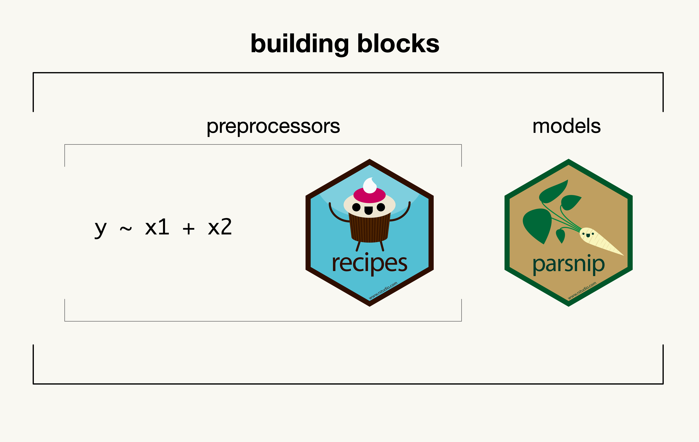
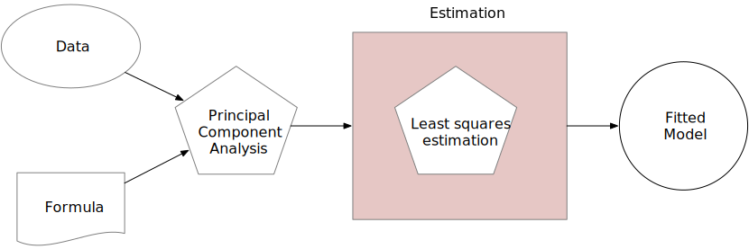
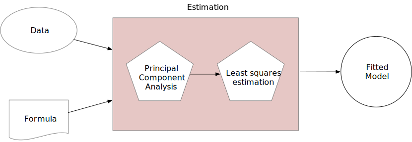

class: title-slide, left, middle
background-position: 85% 50%
background-size: 30%
background-color: #F9F8F3

.pull-left[

# `r rmarkdown::metadata$title`

### `r rmarkdown::metadata$author`

### `r rmarkdown::metadata$date`
]

```{r startup, include = FALSE}
library(doMC)
registerDoMC(cores = 20)
library(tidymodels)
tidymodels_prefer()
thm <- theme_bw() + 
  theme(
    panel.background = element_rect(fill = "transparent", colour = NA), 
    plot.background = element_rect(fill = "transparent", colour = NA),
    legend.position = "top",
    legend.background = element_rect(fill = "transparent", colour = NA),
    legend.key = element_rect(fill = "transparent", colour = NA)
  )
theme_set(thm)
```


---
layout: false
class: inverse, middle, center

# [`tidymodels.org`](https://www.tidymodels.org/)

# _Tidy Modeling with R_ ([`tmwr.org`](https://www.tmwr.org/))


---
# A quick(ish) tour of tidymodels

In tidymodels, there is the idea that a model-oriented data analysis consists of

 - a preprocessor, and 
 - a model
 
The preprocessor might be a simple formula or a sophisticated recipe.  

It's important to consider both of these activities as part of the data analysis process.

 - Post-model activities should also be included there (e.g. calibration, cut-off optimization, etc.)
 - We don't have those implemented yet. 


---
# Basic tidymodels components

```{r blocks, echo = FALSE, out.width="70%", fig.align='center'}

```


---
# A relavant example

Let's say that we have some highly correlated predictors and we want to reduce the correlation by first applying principal component analysis to the data. 

 - AKA principal component regression
 
---
# A relavant example

Let's say that we have some highly correlated predictors and we want to reduce the correlation by first applying principal component analysis to the data. 

 - AKA ~~principal component regression~~ feature extraction


---
# A relavant example

Let's say that we have some highly correlated predictors and we want to reduce the correlation by first applying principal component analysis to the data. 

 - AKA ~~principal component regression~~ feature extraction

What do we consider the estimation part of this process? 


---
# Is it this? 

```{r faux-model, echo = FALSE, out.width="70%", fig.align='center'}

```


---
# Or is it this? 

```{r real-model, echo = FALSE, out.width="70%", fig.align='center'}

```


---
# What's the difference?

It is easy to think that the model fit is the only estimation steps. 

There are cases where this could go really wrong: 

* Poor estimation of performance (buy treating the PCA parts as known)

* Selection bias in feature selection

* Information leakage

These problems are exacerbated as the preprocessors increase in complexity and/or effectiveness. 


---
# The model workflow

A _model workflow_ is an object that combines a preprocessor and a model object. 

Why? 

Two reasons: 

* It can help organize your work (in case you try a lot of models and preprocessors)

* It encapsulates all of the estimation parts in one object

You can't just estimate one part. 


---
# The model workflow in R

```{r tm-objs, message = FALSE, warning = FALSE}
library(tidymodels)
data(Chicago)

split <- initial_split(Chicago)
chicago_train <- training(split)
chicago_test <- testing(split)

reg_model <- linear_reg() %>% set_engine("lm")

pca_rec <- recipe(ridership ~ ., data = chicago_train) %>% 
  step_date(date, features = c("dow", "month", "year")) %>% 
  step_holiday(date) %>% 
  update_role(date, new_role = "id") %>% 
  step_dummy(all_nominal_predictors()) %>% 
  step_normalize(all_numeric_predictors()) %>% 
  step_pca(one_of(stations), num_comp = 10) 

pca_lm_wflow <- 
  workflow() %>% 
  add_model(reg_model) %>% 
  add_recipe(pca_rec)
```


---
# The good and bad estimation

Bad approach leading to information leakage:

```{r tm-bad, eval = FALSE}
modeling_data <- 
  prep(pca_rec, training = Chicago) %>% 
  bake(new_data = NULL)

bad <- fit(reg_model, modeling_data)

predict(bad, chicago_test)
```

Much better:

```{r tm-good, eval = FALSE}
good <- fit(pca_lm_wflow, chicago_train)

predict(good, chicago_test)
```


---
# Many workflows

You can imagine a case where, for a new data set, we don't know what predictors, features, or model are most effective.

.font80[

* A good example of this, for the Chicago data, is shown in our [_Feature Engineering and Selection_](https://bookdown.org/max/FES/a-more-complex-example.html) book. 

]

We might want to define a group of preprocessors to try in concert with numerous models. 

.font80[

* PCA versus PLS and other extraction methods.
* Simple filtering of highly correlated predictors. 
* No extraction and use a regularized model. 

]

and so on. 

---
# Where do I use a workflow set?

## When would you use this? 

It's good for cases where you are starting from scratch and need to fit (and/or tune) a lot of models. 

It might be good for variable selection  (see example at end). 

## Would you always want to do this? 

**Absolutely not**. For well-defined problems, it is overkill. 

I was hesitant to even create this package since it might be used inappropriately. 


---
# A workflow set

These are objects that contain multiple workflows. 

They can be estimated, evaluates, and ranked with simple APIs. 

Let's create one by crossing several recipes with two models for the Chicago data.

---
# Example objects

```{r make-models}
reg_model <- linear_reg() %>% set_engine("lm")

nnet_model <- 
  mlp(penalty = tune(), hidden_units = tune(), epochs = tune()) %>% 
  set_engine("nnet") %>% 
  set_mode("regression")
```

```{r make-recipes}
simple_rec <- recipe(ridership ~ ., data = chicago_train) %>% 
  step_date(date, features = c("dow", "month", "year")) %>% 
  step_holiday(date) %>% 
  update_role(date, new_role = "id") %>% 
  step_dummy(all_nominal_predictors()) %>% 
  step_normalize(all_numeric_predictors()) 

pca_rec <- simple_rec %>% 
  step_pca(one_of(stations), num_comp = tune()) 

pls_rec <- simple_rec %>% 
  step_pls(one_of(stations), outcome = "ridership", num_comp = tune()) 

filter_rec <- simple_rec %>% 
  step_corr(one_of(stations), threshold = tune())
```


---
# Creating the workflow set

```{r make-workflow-set}
chicago_wflows <- 
  workflow_set(
    preproc = list(basic = simple_rec, pca = pca_rec, pls = pls_rec,
                   filtered = filter_rec),
    models = list(lm = reg_model, nnet = nnet_model)
  )
chicago_wflows
```


---
# Evaluating many models

```{r estimation, cache = TRUE}
# 43 resamples via rolling forecast origin resampling
chicago_rs <- 
  sliding_period(
    chicago_train,
    date,
    period = "month",
    lookback = 12 * 12,  # a rolling 12-year data set for fitting
    assess_stop = 1      # evaluate the model on the first new month
  )

chicago_res <- 
  chicago_wflows %>% 
  workflow_map(resamples = chicago_rs,
               seed = 1, 
               # Optional arguments to tune_grid()
               grid = 20,
               metrics = metric_set(rmse))
```


---
# Results

```{r print}
chicago_res
```


---
# Rankings

```{r rank}
chicago_res %>% 
  rank_results(select_best = TRUE) %>% 
  dplyr::select(wflow_id, .metric, mean, std_err, n, rank)
```


---
# Rankings (everything)


.pull-left[
```{r plot-all-code, eval = FALSE}
chicago_res %>% 
  autoplot()
```
]
.pull-right[
```{r plot-all, out.width = '90%', fig.align='center', dev = 'svg', dev.args = list(bg = "transparent"), echo = FALSE, fig.width=5, fig.height=5}
chicago_res %>% autoplot()
```

]


---
# Rankings (best of each workflow)


.pull-left[

```{r plot-comp, eval = FALSE}
chicago_res %>% 
  autoplot(select_best = TRUE)
```

]
.pull-right[

```{r plot, out.width = '90%', fig.align='center', dev = 'svg', dev.args = list(bg = "transparent"), echo = FALSE, fig.width=5, fig.height=5}
chicago_res %>% autoplot(select_best = TRUE)
```

]

---
# Passing individual options to models

The _minimum_ correlation between station predictors is 0.88. Let's adjust the parameter range for the threshold parameter to be between 0.87 and .99. 

We can create `dials` parameter objects to do this. 

```{r params, warning = FALSE}
lm_param <- 
  pull_workflow(chicago_wflows, "filtered_lm") %>% 
  parameters() %>% 
  update(threshold = threshold(c(0.87, .99)))

nnet_param <- 
  pull_workflow(chicago_wflows, "filtered_nnet") %>% 
  parameters() %>% 
  update(threshold = threshold(c(0.87, .99)))
```

---
# Passing individual options to models

Now let's update the `option` file for those two workflows and refit: 

```{r updates, cache = TRUE}
filtered_res <- 
  chicago_res %>% 
  option_add(param_info = lm_param,   id = "filtered_lm") %>% 
  option_add(param_info = nnet_param, id = "filtered_nnet") %>% 
  filter(grepl("filtered", wflow_id)) %>% 
  workflow_map(resamples = chicago_rs,
               seed = 1, 
               # Optional arguments to tune_grid()
               grid = 20,
               metrics = metric_set(rmse))
```


---
# Updating the set

.code70[

.pull-left[
```{r binding}
updated_res <- 
  chicago_res %>% 
  filter(!grepl("filtered", wflow_id)) %>% 
  bind_rows(filtered_res)

updated_res %>% 
  rank_results(select_best = TRUE) %>% 
  dplyr::select(wflow_id, .metric, mean, std_err, n, rank)
```
]
.pull-right[

Plot the tuning results for a model:

```{r tune-comp, eval = FALSE}
updated_res %>% 
  autoplot(id = "filtered_nnet")
```
```{r tune, out.width = '70%', fig.align='center', dev = 'svg', dev.args = list(bg = "transparent"), echo = FALSE, fig.width=5, fig.height=5}
updated_res %>% 
  autoplot(id = "filtered_nnet")
```
]

]


---
# Bayesian analysis of the results


.pull-left[
```{r bayes-comp, eval = FALSE}
library(tidyposterior)
rmse_res <-
  updated_res %>%
  perf_mod(
    iter = 5000,
    chains = 10,
    cores = 10,
    seed = 2,
    refresh = 0
  )

# Assess a difference of 150 riders in MAE
rmse_res %>% 
  autoplot(type = "ROPE", size = 0.15) 
```
]
.pull-right[
```{r bayes, out.width = '90%', fig.align='center', dev = 'svg', dev.args = list(bg = "transparent"), echo = FALSE, fig.width=5, fig.height=5, cache = TRUE}
library(tidyposterior)
rmse_res <-
  updated_res %>%
  perf_mod(
    iter = 5000,
    chains = 10,
    cores = 10,
    seed = 2,
    refresh = 0
  )
rmse_res %>% autoplot(type = "ROPE", size = 0.15)
```
]

---
# Bonus: Fast screening using racing

Racing is an adaptive grid search method that only focuses on tuning parameter combinations that have a good probability of being the best results. 

After an initial period, some tuning parameter combinations are removed if they have no chance of being best. 

This reduces the overall number of model fits. 

See Sections [13.4.4](https://www.tmwr.org/grid-search.html#racing) and [15.4](https://www.tmwr.org/workflow-sets.html#racing-example) of _Tidy Models with R_

---
# Bonus: Fast screening using racing

To use it, map over `"tune_race_anova"` or `"tune_race_win_loss"` after loading the `finetune` package:

```{r race, eval = FALSE}
library(finetune)
racing_res <- 
  chicago_res %>% 
  workflow_map("tune_race_anova",
               resamples = chicago_rs,
               seed = 1, 
               grid = 20,
               metrics = metric_set(rmse))
```


---
# Bonus Bonus: Create an ensemble via stacking

```{r stacks, eval = FALSE}
library(stacks)
ens <- 
  stacks() %>% 
  add_candidates(updated_res) %>% 
  blend_predictions() %>% 
  fit_members()
```

This requires the devel version of `stacks` and you will have had to save the out-of-sample predictions for each model (via a `control` argument).

This is similar to the approach taken in [h2o AutoML](https://docs.h2o.ai/h2o/latest-stable/h2o-docs/automl.html). 

See [`stacks.tidymodels.org`](https://stacks.tidymodels.org/) and the upcoming [Chapter 20 of _Tidy Models with R_](https://www.tmwr.org/ensemble.html) for more information. 

---
# Model selection/variable assessment 

Let's say that we want to assess the impact of each predictor in a model. 

We can fit the model with and without the predictor and assess the effect. 

```{r loo}
data(biomass)
biomass <- biomass %>% select(-sample, -dataset)

f <- HHV ~ (.)^2
loo_f <- leave_var_out_formulas(f, data = biomass, full_model = TRUE)
length(loo_f)
loo_f[["oxygen"]]
```


---
# Model selection/variable assessment 


.pull-left[

.code80[

```{r fits, cache = TRUE}
set.seed(3)
boots <- bootstraps(biomass)
biomass_models <-
  workflow_set(
    preproc = loo_f,
    models = list(lm = reg_model)
  ) %>%
  workflow_map(
    "fit_resamples",
    resamples = boots,
    metrics = metric_set(mae),
    seed = 4
  )

mae_stats <-
  collect_metrics(biomass_models, 
                  summarize = FALSE) %>%
  dplyr::select(wflow_id, .estimate, id)

full_model <-
  filter(mae_stats, 
         wflow_id == "everything_lm") %>%
  dplyr::select(id, full_model = .estimate)
```

]

]
.pull-right[
Estimate the mean absolute error for various predictor subsets. 

If the predictor is important, removing it makes performance worse.
]


---
# Which model terms are important?

.pull-left[

.code70[

```{r loss-plot-calc, eval = FALSE}
left_join(mae_stats, full_model, by = "id") %>% 
  mutate(loss = .estimate - full_model) %>% 
  filter(wflow_id != "everything_lm") %>% 
  mutate(term = gsub("_lm", "", wflow_id)) %>% 
  nest_by(term) %>%
  mutate(stats = list(t.test(loss ~ 1, data = data))) %>%
  summarise(tidy(stats), .groups = "drop") %>% 
  ggplot(aes(x = estimate, y = reorder(term, estimate)))+ 
  geom_point() + 
  geom_vline(xintercept = 0, lty = 2, col = "red") + 
  geom_errorbar(aes(xmin = conf.low, xmax = conf.high), 
                width = .25) +
  labs(x = "Loss of MAE", y = NULL)
```

]

]
.pull-right[
```{r loss-plot, out.width = '90%', fig.align='center', dev = 'svg', dev.args = list(bg = "transparent"), echo = FALSE, fig.width=5, fig.height=5.5}
left_join(mae_stats, full_model, by = "id") %>% 
  mutate(loss = .estimate - full_model) %>% 
  filter(wflow_id != "everything_lm") %>% 
  mutate(term = gsub("_lm", "", wflow_id)) %>% 
  nest_by(term) %>%
  mutate(stats = list(t.test(loss ~ 1, data = data))) %>%
  summarise(tidy(stats), .groups = "drop") %>% 
  ggplot(aes(x = estimate, y = reorder(term, estimate)))  + 
  geom_point() + 
  geom_vline(xintercept = 0, lty = 2, col = "red") + 
  geom_errorbar(aes(xmin = conf.low, xmax = conf.high), width = .25) +
  labs(x = "Loss of MAE", y = NULL)
```
]


---
# Summary

Workflow sets can be very helpful when you need to fit a lot of models or want to create a stacking ensemble. 

They can also be nice if you want to track/collate/rank results over models that have already been fit (via `as_workflow_set()`). 

I don't see them as a staple of regular tidymodels analyses. 


