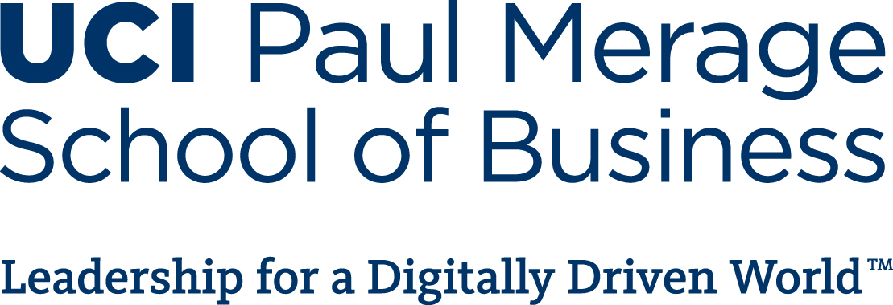

```{r setup, include=FALSE}
options(htmltools.dir.version = FALSE)
options(servr.daemon = TRUE)
```

# Welcome

.large[
* Schedule
    * 6:00 - 6:05 Welcome & Announcements
    * 6:05 - 7:00 High-Performance Time Series Analysis with Modeltime
]

---
class: hide-logo
# Sponsors
<br>
<br>
  

---
class: hide-logo
# Sponsors
<br>
<br>


---
class: hide-logo
# Announcements & Acknowledgements

* _**SoCal RUG Hackathon**_ 
<br>**Date**: Sat-Sun, April 2-3
<br>**Location**: University of California, Irvine
<br>**Event Details**: [Hackathon Meetup page](https://www.meetup.com/SOCAL-RUG/events/284479173/)
<br>This event is sold out

* _**SoCal RUG Book Club**_
<br>**Book**: Forecasting (3rd ed, 2021)
<br>**Date**: From April 11 to May 30, the book club will meet weekly on Mondays from 4:00 - 5:00pm PST
<br>**Authors**: Hyndman & Athanasopoulos
<br>**Online**: [https://otexts.com/fpp3/](https://otexts.com/fpp3/)
<br>**Print**: [https://www.amazon.com/Forecasting-Principles-Practice-Rob-Hyndman/dp/098750713](https://www.amazon.com/Forecasting-Principles-Practice-Rob-Hyndman/dp/098750713)

---
class: hide-logo
# Announcements & Acknowledgements

* _**Short Workshop: Data Visualization with R**_
<br>**Event**: SCASA's 41st Annual (_VIRTUAL_) Applied Statistics Workshop
<br>**Date**: Saturday, April 23, 9:00am-4:00pm
<br>**Location**: via Zoom ([https://apu.zoom.us/j/84503314039](https://apu.zoom.us/j/84503314039))
<br>**Cost**: Free, and registration is not needed
<br>**Details**: The _Southern California Chapter of the American Statistical Association_ [_(SCASA)_](https://community.amstat.org/scasa/home) is hosting a free workshop led by Dr. Robert Kabacoff, Professor of the Practice in Quantitative Analysis at Wesleyan University, Connecticut. Dr. Kabacoff is the author of _R in Action: Data
Analysis and Graphics with R (3rd ed.)_, and maintains a popular website called Quick-R ([www.statmethods.net](www.statmethods.net)). His upcoming book _Modern Data Visualization with R_ will be published this summer (CRC Press).

* _**Presentation: Intro to the Healthyverse**_ 
<br>**Date**: Wednesday, April 27, 5:30pm PST
<br>**Location**: Virtual via Zoom
<br>**Event Details**: [Steven Paul Sanderson II](https://www.linkedin.com/in/spsanderson/) will introduce the [healthyverse](https://www.spsanderson.com/healthyverse/) collection of packages that allows for tidy-friendly analysis and presentation of typical hospital data.
<br>RSVP: [https://www.meetup.com/SOCAL-RUG/events/284815529/](https://www.meetup.com/SOCAL-RUG/events/284815529/)

---
class: hide-logo
# Connect with us
**SoCal RUG**
.large[
* Website: https://socalr.org
* GitHub: https://github.com/socalrug
* Slack: https://socalrug.slack.com
* YouTube: https://www.youtube.com/c/SouthernCaliforniaRUsersGroup
* Twitter @socalrug
* Linkedin: https://www.linkedin.com/company/socalrug/
]

---
class: hide-logo
# Talk

### High-Performance Time Series Analysis with Modeltime
#### Speaker: **Matt Dancho**
* Matt Dancho is the creator of [tidyquant](https://business-science.github.io/tidyquant/) and [timetk](https://business-science.github.io/timetk/) packages (w/ over 1.5 million downloads), the founder of Business Science, and the author of the [Modeltime](https://business-science.github.io/modeltime/) ecosystem of packages

* Prior to founding Business Science, Matt was a data science director for an industrial manufacturer

* Modeltime provides a unified framework for tidy time-series analyses with a growing ecosystem of Modeltime forecasting packages including:
  * Modeltime (Machine Learning),
  * Modeltime H2O (AutoML),
  * Modeltime GluonTS (Deep Learning),
  * Modeltime Ensemble (Blending Forecasts), and
  * Modeltime Resample (Backtesting)